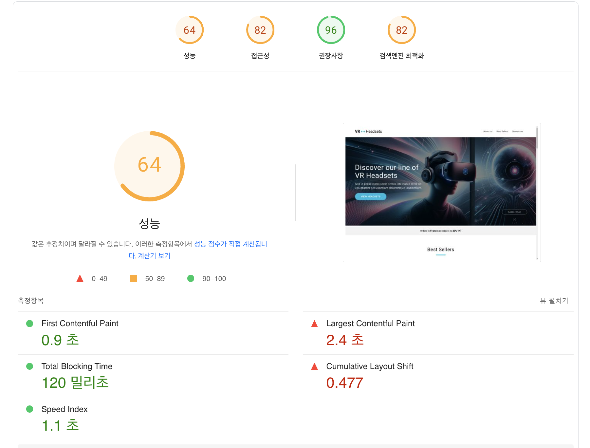
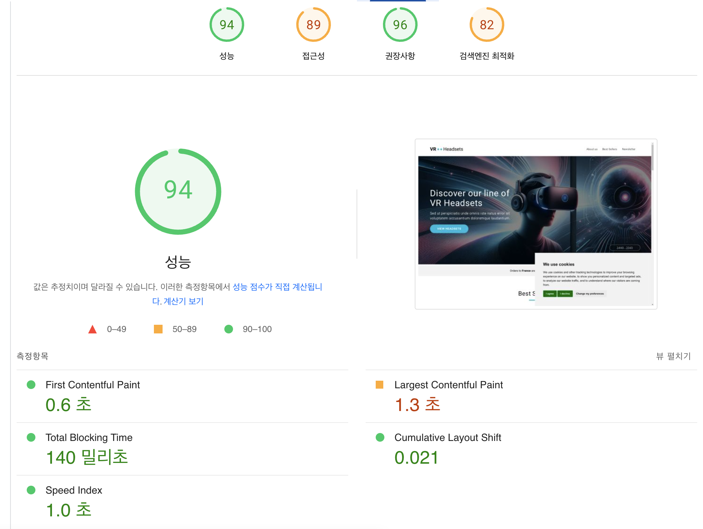

# 바닐라 JS 프로젝트 성능 개선

- url: https://d368r6mf5d4smv.cloudfront.net/

## 1. 개선 이유

### 1.1 이미지 크기 및 포맷 비효율

- 히어로 이미지와 주요 콘텐츠 이미지가 오래된 포맷으로 제공되고 있고 최적화 되지 않은 해상도로 인해 로드 시간이 증가하였습니다.
- 이로 인한 사용자 이탈율 증가의 위험이 있습니다.

### 1.2 이미지 로딩 비효율

- 뷰포트 밖에 있는 이미지도 초기에 전체 로드하여 초기 렌더링 속도가 저하되었습니다.
- 불필요한 네트워크 자원이 소비되었습니다.

### 1.3 폰트 최적화 미흡

- 웹 폰트를 로드하기 전에 기본 폰트가 노출되는데 이때 레이아웃이 변경되어 일관성 없는 사용자 경험을 제공하게 되었습니다.
- 또한 폰트를 로드하면서 렌더링을 블락하는 상황이 발생하였습니다.

### 1.4 자바스크립트 실행 순서 문제

- DOM 로드 전 Javascript 실행으로 인해 에러가 발생하고, DOM 렌더링을 차단하게 되었습니다.

## 2. 개선 방법

### 2.1 이미지 최적화

- webp 포맷으로 이미지를 변환하는 스크립트(optimize-images.js)를 작성하여, ci때 버킷에 이미지를 변환하여 업로드하도록 구현하였습니다.
- 또한 디바이스 별로 최적화된 해상도를 지원하였습니다.
- img의 지연 로딩 옵션을 사용하여 뷰포트 내의 이미지는 우선 로딩하고, 뷰포트 밖의 이미지는 지연 로딩하여 초기 로드 속도를 개선하였습니다.

### 2.2 폰트 최적화

- woff, woff2 포맷을 적용하고, google font를 통해 로드하던 폰트 파일을 에셋에서 폰트 파일을 제공하여 로딩 속도를 개선하였습니다.

### 2.3 Javascript 로딩 최적화

- defer 속성을 적용하여 HTML 문서의 파싱이 완전히 완료된 후 실행되도록 변경하였습니다.
- DOMContentLoaded를 활용하여 DOM이 완전히 로드된 후에 코드를 실행하도록 보장하고 오류를 방지했습니다.

## 3. 개선 후 향상된 지표

| 개선 전                              | 개선 후                             |
| ------------------------------------ | ----------------------------------- |
|  |  |

### 3.1 전반적인 성능 점수

- 성능 점수가 64점에서 94점으로 47% 향상
- 접근성 지표 82점에서 89점으로 개선

### 3.2 핵심 성능 지표 개선

- First Contentful Paint (FCP): 0.9초에서 0.6초로 33% 개선
- Largest Contentful Paint (LCP): 2.4초에서 1.3초로 46% 개선
- Total Blocking Time (TBT): 120밀리초에서 140밀리초로 소폭 증가
- Cumulative Layout Shift (CLS): 0.477에서 0.021로 대폭 개선
  - 이미지 사이즈 명시 및 폰트 최적화 효과
- Speed Index: 1.1초에서 1.0초로 개선

### 3.3 사용자 경험 지표

- 페이지 초기 로딩 시 레이아웃 변경 최소화
- 콘텐츠 가시성 시간 단축
- 브라우저 리소스 사용 효율성 증가

이러한 개선으로 Google의 Core Web Vitals 기준을 대부분 충족하게 되었으며, 특히 사용자가 체감하는 초기 로딩 속도와 레이아웃 안정성이 크게 향상되었습니다.

## 4. 개인적인 질문

LightHouse를 확인하던 중에 이미지에 대한 캐싱을 진행하면 좋겠다는 생각이 들었습니다.

기존에는 no-cache로 되어있어 매번 서버에 요청을 보내고 있었는데, 자주 변경되지 않는 이미지 특성상 캐싱을 적용하면 성능 개선에 도움이 될 것 같았습니다.

정적인 페이지니만큼 max-age를 86400로 설정하고 cache-control을 설정해 CloudFront에서 정책 설정을 했는데요(메타데이터), 어째서인지 no-cache로 계속 뜨거나, 304 modified로 뜨는 것을 확인했습니다.

304일때는 cache hit이 발생해서 그런거겠구나 하고 추측하여 LightHouse를 다시 분석했는데, 이때도 이미지 캐싱이 되지 않는 것처럼 분석하고 있었는데요. 혹시 이런 경우엔 어떤 부분을 더 살펴봐야 했을까요?
